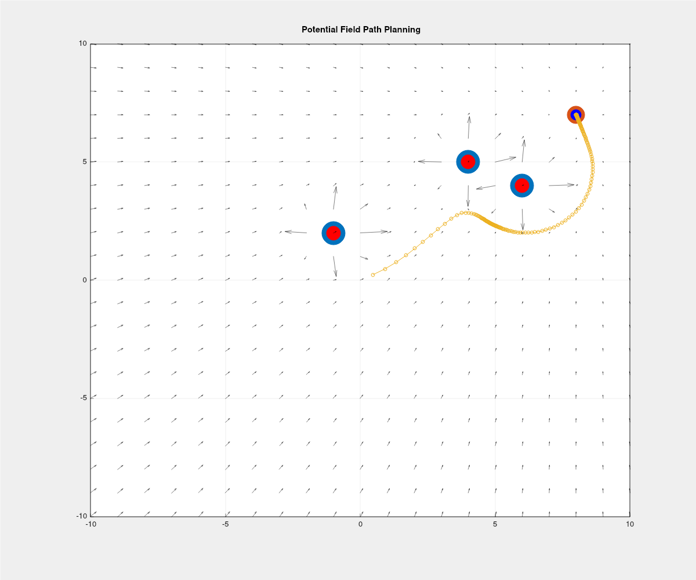

# Potential Field Path Planning (C++)

## Overview

This project implements a **2D potential field-based path planning algorithm** for a point robot navigating toward a goal while avoiding obstacles.

The robot moves according to artificial forces:

* **Attractive force** pulls the robot toward the goal
* **Repulsive force** pushes the robot away from nearby obstacles

The resulting trajectory is visualized along with a vector field using Matplot++.

---



## Key Concepts

### Artificial Potential Fields

Instead of simulating physics (mass, velocity, acceleration), this algorithm operates in a **configuration space**:

* Robot position is updated directly using a force-like rule
* No inertia or dynamics are modeled
* Motion is purely driven by gradient descent on a potential function

---

## Mathematical Formulation

### Attractive Force

Pulls the robot toward the goal:

```
F_att = -k_att * (x - x_goal)
```

### Repulsive Force

Pushes the robot away from obstacles within a sensing radius:

```
F_rep = k_rep * (1/d - 1/d0) * (1/d^2) * direction
```

Where:

* `d` = distance to obstacle
* `d0` = sensing distance
* `direction` = unit vector away from obstacle

---

## Dependencies

You will need the following libraries:

* **Armadillo** (linear algebra)
* **Matplot++** (plotting)

### Install on Ubuntu

```
sudo apt install libarmadillo-dev
```

Matplot++ installation:

```
git clone https://github.com/alandefreitas/matplotplusplus.git
cd matplotplusplus
cmake -B build
cmake --build build
sudo cmake --install build
```

---

## Build Instructions

Compile using g++:

```
g++ main.cpp -o potential_field -larmadillo -lmatplot
```

If Matplot++ is installed locally, you may need to link additional dependencies:

```
g++ main.cpp -o potential_field -larmadillo -lmatplot -lpthread
```

---

## Parameters

| Parameter                    | Description                    | Default |
| ---------------------------- | ------------------------------ | ------- |
| `ATTRACTIVE_INTENSITY_GAIN`  | Strength of attraction to goal | 1.0     |
| `REPULSIVE_INTENSITY_GAIN`   | Strength of obstacle repulsion | 120.0   |
| `REPULSIVE_SENSING_DISTANCE` | Obstacle influence radius      | 2.0     |
| `TIME_STEP`                  | Step size for position update  | 0.05    |
| `TOTAL_ATTEMPTS`             | Max iterations                 | 1000    |
| `GOAL_REACHED_THRESHOLD`     | Convergence tolerance          | 0.001   |

---

## Output Visualization

The program produces a plot showing:

* Robot trajectory (line with markers)
* Obstacles (red points)
* Goal (blue point)
* Vector field indicating direction of motion at each point

---

